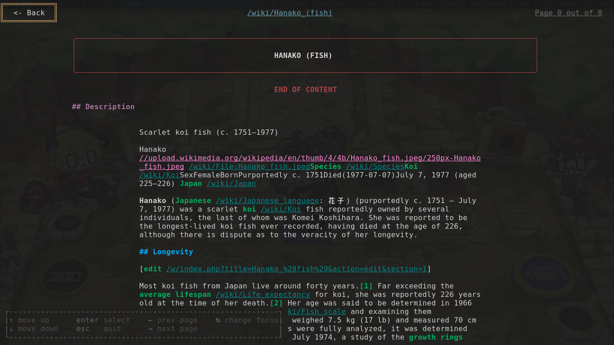

# Search Engine

It uses Wikipedia as indexer, then it scrapes the web pages, ranks them, saves them into redis and tada! It gets rendered out in the client which is really a ssh server. Cool!




#### usage?

- you need redis (or valkey whatever) installed
```bash
go mod tidy # or go mod download whatever

git submodule update --init --recursive # if you didnt clone the repo with --recursive-submodules
redis-server --daemonize yes
go run .

ssh localhost -p 3434 #yay!
```

---

### server
there are at least 3 data types saved in the redis db:

1. hashes: store blob information
2. sortedSet: stores blob's term space (list of all words)
3. set **(no more use)**: list of all files uuid (which represents their names in the data/)

- redis
- elasticSearch
- search metaphone alternative (handle spelling mistakes)
- testing
- have a precomputed pagerank at all times
- make the crawler
- ci

- core
  - tf-idf algo
  - stemming? maybe a library for it
    - [go-porterstemmer](https://github.com/reiver/go-porterstemmer/) (nvm, tests failing)
    - [stemmer](https://github.com/caneroj1/stemmer)

  - make tokenaizer? to group up words at the ratee they appear in the blob

- server protocol + implementation
  - [wish](https://github.com/charmbracelet/wish)? for ssh server?
  - http? (booooring)
  - [zeromq](https://github.com/zeromq/goczmq)? (i'll probably die due to many complications)

### client
- [bubbletea](https://github.com/charmbracelet/bubbletea) as tui
-

### extras (if bored)
- [just](https://github.com/casey/just)
- improve tf by using different schema/ignoring stopwords
- only supports posix due to line feed vs resource nurse manual implementation
